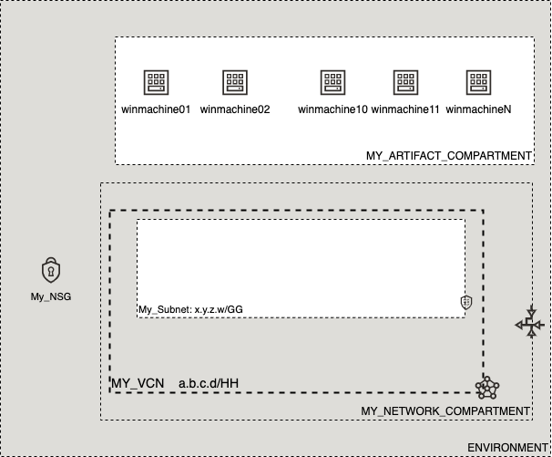

# OCI Cloud Bricks: Windows Compute Instance

[](https://img.shields.io/badge/license-UPL-green) [](https://sonarcloud.io/dashboard?id=oracle-devrel_terraform-oci-cloudbricks-windows-compute)

## Introduction
The following cloud brick enables you to create batches of window computes, starting from 1 to many associated to a specific compartment and specific subnet.

## Reference Architecture
The following is the reference architecture associated to this brick



In this case, you can take advantage of the decoupled nature of the network compartment and the artifact compartment for cost tracking purposes. 
### Prerequisites
- Pre existent Compartment structure
- Pre existent VCN, Subnet and NSG (if applies)

---
## Sample tfvar file
If Flex Shape is in use

```shell
########## FLEX SHAPE IN USE ##########
########## SAMPLE TFVAR FILE ##########
########## PROVIDER SPECIFIC VARIABLES ##########
region           = "foo-region-1"
tenancy_ocid     = "ocid1.tenancy.oc1..abcdefg"
user_ocid        = "ocid1.user.oc1..aaaaaaabcdefg"
fingerprint      = "fo:oo:ba:ar:ba:ar"
private_key_path = "/absolute/path/to/api/key/your_api_key.pem"
########## PROVIDER SPECIFIC VARIABLES ##########


########## ARTIFACT SPECIFIC VARIABLES ##########****
ssh_public_key                   = "./relative/path/to/ssh/key/public_ssh_key.pub"
ssh_private_key                  = "./relative/path/to/ssh/key/private_ssh_key"
ssh_public_is_path               = true
ssh_private_is_path              = true
compute_availability_domain_list = ["aBCD:foo-REGION-1-AD-1", "aBCD:foo-REGION-1-AD-2","aBCD:foo-REGION-1-AD-3" ]

network_subnet_name                     = "My_Subnet"
assign_public_ip_flag                   = true
fault_domain_name                       = ["FAULT-DOMAIN-1", "FAULT-DOMAIN-2", "FAULT-DOMAIN-3"]
bkp_policy_boot_volume                  = "gold"
windows_compute_instance_compartment_name = "MY_ARTIFACT_COMPARTMENT"
windows_compute_network_compartment_name  = "MY_NETWORK_COMPARTMENT"
vcn_display_name                        = "MY_VCN"
num_instances                           = 1
is_nsg_required                         = true
compute_nsg_name                        = "My_NSG"
compute_display_name_base               = "winmachine"
instance_image_ocid                     = "ocid1.image.oc1.sa-santiago-1.aaaaaaaaaawshehk5nk3h7tt3gj6obzwjeohbmknuslro4biuqk7enaaihna" #Image: Windows-Server-2019-Standard-Edition-VM-2021.04.13-0
instance_shape                          = "VM.Standard.E4.Flex"
is_flex_shape                           = true
instance_shape_config_ocpus             = 1
instance_shape_config_memory_in_gbs     = 16
########## ARTIFACT SPECIFIC VARIABLES ##########
########## SAMPLE TFVAR FILE ##########
########## FLEX SHAPE IN USE ##########
```

If flex shape is not in use

```shell
########## FLEX SHAPE NOT IN USE ##########
########## SAMPLE TFVAR FILE ##########
########## PROVIDER SPECIFIC VARIABLES ##########
region           = "foo-region-1"
tenancy_ocid     = "ocid1.tenancy.oc1..abcdefg"
user_ocid        = "ocid1.user.oc1..aaaaaaabcdefg"
fingerprint      = "fo:oo:ba:ar:ba:ar"
private_key_path = "/absolute/path/to/api/key/your_api_key.pem"
########## PROVIDER SPECIFIC VARIABLES ##########


########## ARTIFACT SPECIFIC VARIABLES ##########****
ssh_public_key                   = "./relative/path/to/ssh/key/public_ssh_key.pub"
ssh_private_key                  = "./relative/path/to/ssh/key/private_ssh_key"
ssh_public_is_path               = true
ssh_private_is_path              = true
compute_availability_domain_list = ["aBCD:foo-REGION-1-AD-1", "aBCD:foo-REGION-1-AD-2","aBCD:foo-REGION-1-AD-3" ]

network_subnet_name                       = "My_Subnet"
assign_public_ip_flag                     = true
fault_domain_name                         = ["FAULT-DOMAIN-1", "FAULT-DOMAIN-2", "FAULT-DOMAIN-3"]
bkp_policy_boot_volume                    = "gold"
windows_compute_instance_compartment_name = "MY_INSTANCE_COMPARTMENT"
windows_compute_network_compartment_name  = "MY_NETWORK_COMPARTMENT"
vcn_display_name                          = "MY_VCN"
num_instances                             = 1
is_nsg_required                           = true
compute_nsg_name                          = "My_NSG"
compute_display_name_base                 = "winmachine"
instance_image_ocid                       = "ocid1.image.oc1.sa-santiago-1.aaaaaaaaaawshehk5nk3h7tt3gj6obzwjeohbmknuslro4biuqk7enaaihna" #Image: Windows-Server-2019-Standard-Edition-VM-2021.04.13-0
instance_shape                            = "VM.Standard2.1"
########## ARTIFACT SPECIFIC VARIABLES ##########
########## SAMPLE TFVAR FILE ##########
########## FLEX SHAPE NOT IN USE ##########
```

### Variable specific considerations

- Specific SSH Keys can be used for creating compute in batches. These can be included inside the same system from where brick module is being used. 
- Is possible to use as many AD as are available on the region currently in use. These can be passed on separated by commas and enclosed by double quotes
- Any boot volume backup policy available in your tenancy can be used, whereas this can be default or a custom one
- The number of instances can be overriden by providing a number on variable num_instances. This variable can never be less than 1
- NSG creation is optonal. If NSG is required or not for your instance. If NSG is required for instance, provide variable `is_nsg_required` as true and pass on an NSG Name on variable `compute_nsg_name`. Otherwise, set `is_nsg_required` as false and either drop/delete the variable `compute_nsg_name` or blank it out by passing `""` as argument
- A full OCID of the image wanted to be used to create compute is required. A full list of OCID is available in the [following link](https://docs.oracle.com/en-us/iaas/images/)
- If FLEX shape is required, variable `is_flex_shape` should be set to `true`
  - Mandatory `instance_shape_config_ocpu` and `instance_shape_config_memory_in_gbs` are required when flex image is in use
  - If instance_shape is not flex, variable `is_flex_shape` should be set to `false` and then drop the usage of `instance_shape_config_ocpu` and `instance_shape_config_memory_in_gbs` variables by deleting them or using `""` as the value.
- Upon creating the machine set, be sure to grab the initial password from the output of the commandline when executed. The password of Windows will be in the output of the module and will look like this:
  ```shell
   instance_password = [
      - "n][HKRajhJJ7:nZq",
    ]
  ```
---

## Variable documentation


## Contributing
This project is open source.  Please submit your contributions by forking this repository and submitting a pull request!  Oracle appreciates any contributions that are made by the open source community.

## License
Copyright (c) 2021 Oracle and/or its affiliates.

Licensed under the Universal Permissive License (UPL), Version 1.0.

See [LICENSE](LICENSE) for more details.
